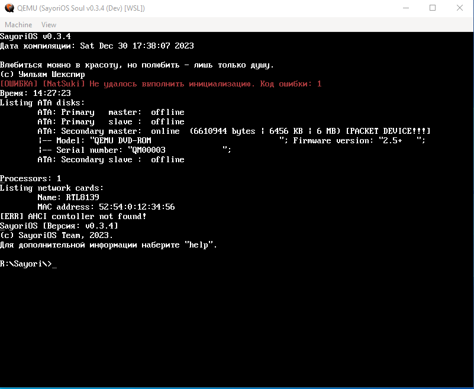
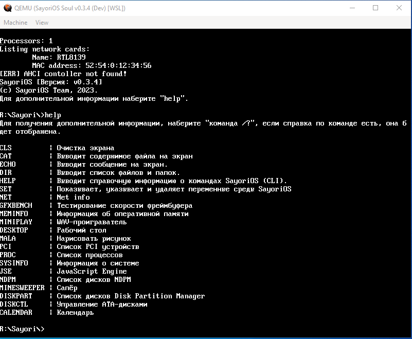
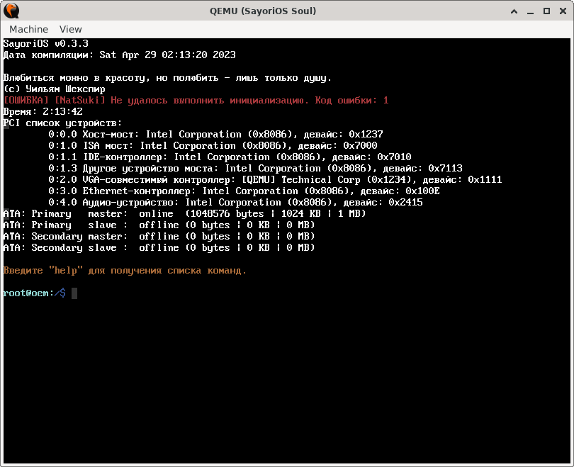
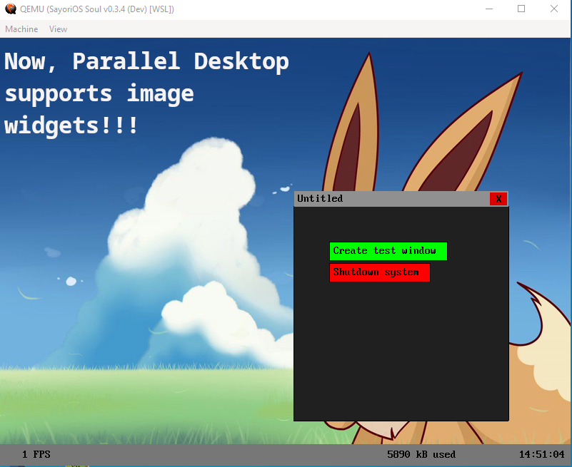
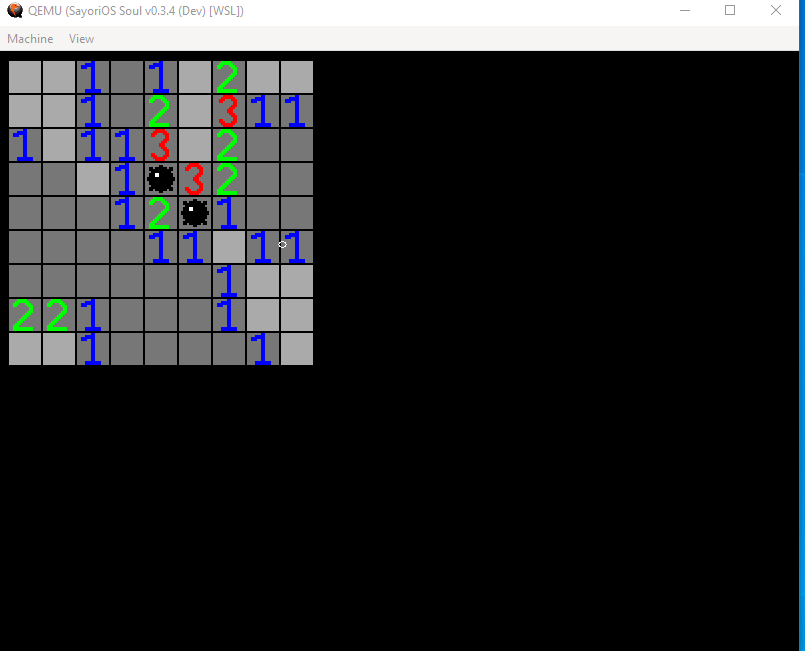
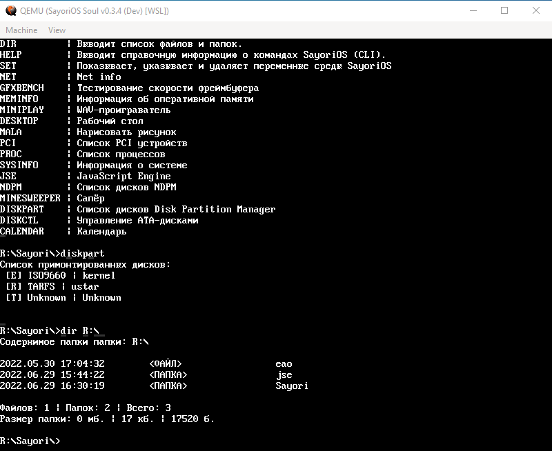
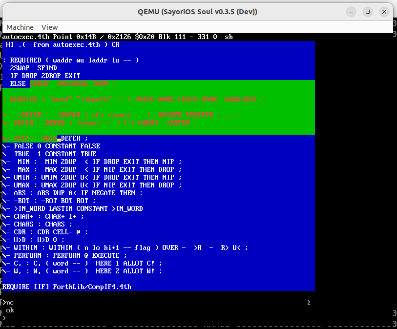
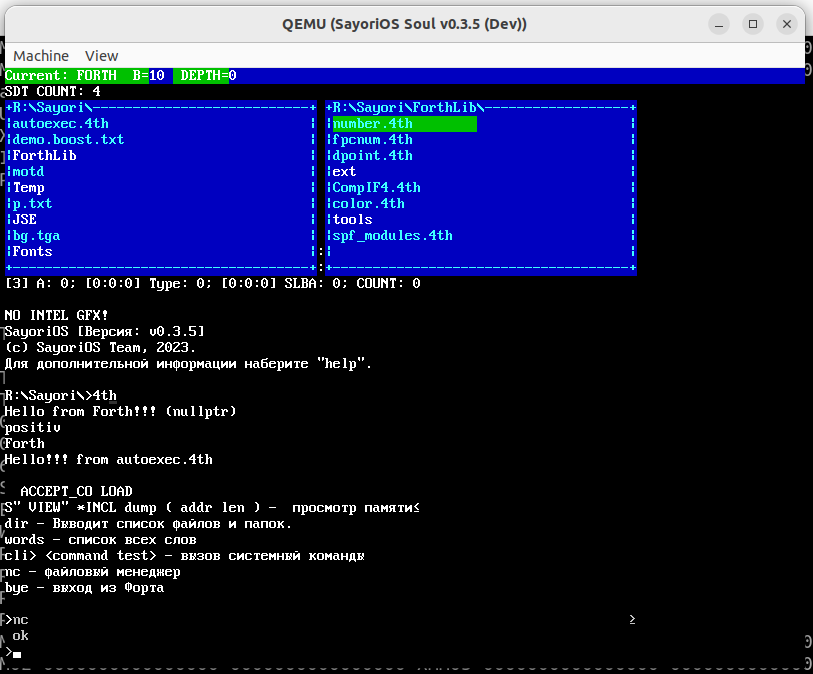

# SayoriOS - open source kernel

 

Simple OS for PC's on x86 (i386) architecture. Writed in C, C++, ASM.

Site of project: https://sayorios.piminoff.ru

* [VK Group](https://vk.com/sayorios)
* [Telegram](https://t.me/sayorios)
* [Telegram Chat](https://t.me/sayorios_chat)

Contents:
- [Targets](#targets)
- [Screenshots](#screenshots)
- [System requirements](#sysrequirements)
- [Roadmap](#roadmap)
- [Build](#build)
- [Run](#run)
  - [Running in Qemu](#run_qemu)
  - [Running in VirtualBox](#run_virtualbox)
- [Contribution](#contibution)
  - [Developers](#developers)
  - [Testers](#testers)
  - [Tech Writers](#techwriters)
  - [Distribution](#adv)
- [Legal Info](#legalinfo)
  - [Denial of responsibility](#denialofresponsibility)
- [Key contributors](#contributors)

Huge thanks, for people who supports the project by star or by contributions:

## <a id="targets">Targets</a>

A miniature experimental operating system with a graphical user interface, memory protection, and a set of tools for system and application development from within the OS.

## <a id="screenshots">Screenshots</a>

## <a id="sysrequirements">System requirements</a>

- CPU: x86_32 or x86_64 (1 core; 1 GHz)
- RAM: 64 MB
- HDD/SSD: optionally
- COM-ports: 2 (for debugging)
- FDD: optionally
- Videoadapter: 4 MB+

## <a id="roadmap">Roadmap</a>

    | Component | Readiness  | Left               |
    |-----------|------------|--------------------|
    | Kernel    |        50% | 10/20              |
    | Drivers   |        90% | 9/10               |
    | Files     |        80% | 8/10               |
    | Network   |        33% | 1/3                |
    | Etc.      |        66% | 6/9                |

Components:
- Kernel
  - Memory manager (Virtual RAM, kernel heap)
  - Work with CMOS (allows you to get the time)
  - Base libs (basis for extending kernel functionality)
  - Threads
  - Processes
  - Work with PCI
  - Device manager ([TODO] Allows you to turn the device on/off)
- Drivers
  - PS/2 Keyboard (Common keyboard driver for I/O stuff)
  - PS/2 Mouse
  - PC Speaker
  - USB ([TODO] Support of USB devices e.g mouse, keyboard, etc.)
  - Realek RTL-8139 (Network driver)
- Files and folders
  - VFS Will allow you to avoid wondering which device the file is on.
  - Sayori Easy File System (Simple FS for virtual disk)
  - Work with real hardware ([TODO] Support of IDE/ATA/S-ATA)
  - TarFS ([TODO] Virtual disk in archive format)
  - FAT 12/16/32 ([TODO] for the USB support)
  - Milla ([TODO] ...)
- Network
  - Protocols ([TODO] Without protocols network is pointless)
- Other
  - Programs ELF32 (Support and run in kernel)
  - CPU Detection (Getting CPU info)
  - FPU Support (To work with floating point numbers)
  - SAF Support ([TODO] Sayori Application File)
  - UEFI Support

## <a id="build">Build</a>

If you want write programs for SayoriOS you probably need the SayoriSDK: https://github.com/pimnik98/SayoriSDK

For compilation you will need Linux/Linux-libre distribution, in which installed the software for build. On Debian-like systems you can copy and paste this command:

    sudo apt-get install python3 clang llvm grub-pc-bin xorriso mtools lld git fasm make g++

And also you will need to install testing software:

    sudo apt-get install libvirt-daemon libvirt-clients bridge-utils virt-manager qemu-kvm qemu virt-manager

Then clone the repo:

    git clone https://github.com/pimnik98/SayoriOS.git

Changing directory:

    cd SayoriOS

Start building:

    make

Run:

    make bir

List of make targets:

    make - Classic build
    make run - Common run in QEMU with debug output to Qemu.log
    make runlive - Common run in QEMU with debug output to console
    make uefi - Run of emulator in UEFI mode
    make geniso - Classic ISO build
    make genuefi - Kernel build with UEFI
    make clean - removes ISO file
    make clean-objs - removes cache files
    make link - link of the kernel files
    make bir - Build of ISO and kernel run
    make WSL - Build of ISO and kernel run from WSL

## <a id="run">Run</a>

### <a id="run_qemu">Running in QEMU</a>

Create a folder, move the kernel file to that folder, install software:

    sudo apt-get install libvirt-daemon libvirt-clients bridge-utils virt-manager qemu-kvm qemu virt-manager

cd to the folder and run emulator

    qemu-system-i386 -cdrom kernel.iso -serial file:Qemu.log -accel kvm -m 128M -name "SayoriOS Soul" -d guest_errors -rtc base=localtime -soundhw pcspk

alternatively you can just make birl

### <a id="run_virtualbox">Running in VirtualBox</a>

Download last stable kernel image
Run the Oracle VM Virtual Box and tap the create button

Switch to detailed mode, not expert mode. If you have the same screen as below, you are in detailed mode.
Specify a convenient name for your virtual machine and its placement path and click next. SayoriOS is used as an example
Type set to Other and version Other/Unknown

Select the amount of RAM that will be allocated to the virtual machine. You can leave the recommended 64 MB, but we recommend that you allocate 256 MB to spare.

Select the virtual hard drive, better to create new one.

Choose a convenient hard disk file format, we recommend VHD (Virtual Hard Disk)

Choose dynamic, so it wont take up space while its not in use.

Now specify the size of the hard disk, 2 gb will be quite enough.

 After creating the virtual machine, do not start it, but go to the settings.

Apply the following settings:

System > Motherboard > Advanced Features > Enable I/O APIC

System > Motherboard > Advanced Features > UTC Clock

Without Nested Paging checkbox - the kernel will work very slow

System > Acceleration > Hardware Virtualization > Enable Nested Paging

Display > Screen > Video Memory > Set 128 MB

Display > Screen > Acceleration > Enable 3D acceleration

Media > Disk > Disk Drive > Optical Drive . Select the kernel file

Network > Adapter 1 > Adapter type > Pair virtual network virtio-net

to get logs from the operating system

COM Ports > Port 1 > Enable Serial Port

COM Ports > Port 1 > Port Mode > Redirect to File

COM Ports > Port 1 > Path/address > File path (if it does not exist, it will be created)

## <a id="contibution">Contribution</a>

New SayoriOS developers and users are welcome! There are several ways you can contribute to the project:

### <a id="developers">If you are a developer</a>

If you are a developer, you can help by adding new features, fixing bugs, or improving existing code. To do this, you need to do the following:

- Download the project repository to your local computer.
- Create a new branch for your work.
- Make changes and commit them using Git.
- Submit a PК to the main project branch.

We welcome your contributions and are willing to consider your PR's.

### <a id="testers">If you are a tester</a>

If you have found a bug in the project or have suggestions for improvement, please create a new Issue in the project repository. Describe the issue or suggestion in detail so we can understand and address it.

Another way to help the project is testing. You can test new features, bug fixes and report issues you find.

Last release: https://github.com/pimnik98/SayoriOS/releases

### <a id="techwriters">Tech writing (Documenting)</a>

Contributions from Technical Writers are welcome!

### <a id="adv">Distribution</a>

If you are willing to do a review of the OS or write about it somewhere, please contact the project steering group.

## <a id="legalinfo">Legal info<a/>

### <a id="denialofresponsibility">Denial of responsibility</a>

SayoriOS is not a Linux/Linux-libre distribution, it is a brand-new project that has no company or organization behind it that can give guarantees.

The SayoriOS kernel is open source, you can verify the absence of malware by examining the files in this repository.

If you use this material, you agree to respect the copyright.

The project participants are not responsible for any damage caused as a result of using the project. Use at your own risk.

It is possible to run the kernel on real hardware, there were tests and on some devices it really ran, though with limitations

## <a id="contributors">Key contributors</a>

* [Никита Пиминов](https://github.com/pimnik98) (Founder of SayoriOS)
* [Андреян Павленко](https://github.com/NDRAEY)
* [Михаил Глухов](https://github.com/rigidus)
