[Read English version](README_EN.MD)

# SayoriOS - открытое публичное ядро операционной системы

 

Простая операционная система для компьютеров на архитектуре x86. Написана на языках Ассемблер, C и C++.

У проекта есть сайт: https://sayorios.piminoff.ru

* [Группа SayoriOS в VK](https://vk.com/sayorios)
* [Канал и чат SayoriOS в Telegram](https://t.me/sayorios)

Список протестированных устройств и результаты тестирования вы можете посмотреть в нашей группе ВКонтакте или во вкладке Issues.

Мы загружаем код на гитхаб каждый релиз. Сюда попадают стабильные версии исходных кодов и образов.

Содержание:
- [Цели](#targets)
- [Скриншоты](#screenshots)
- [Системные требования](#sysrequirements)
- [План работ и прогресс](#roadmap)
- [Сборка](#build)
- [Запуск](#run)
  - [Запуск в QEMU](#run_qemu)
  - [Запуск в VirtualBox](#run_virtualbox)
- [Вклад в проект](#contibution)
  - [Программирование](#developers)
  - [Тестирование](#testers)
  - [Документирование](#techwriters)
  - [Пиар](#adv)
- [Правовая информаиция](#legalinfo)
  - [Отказ от отвественности](#denialofresponsibility)
- [Контрибьюторы](#contributors)

Огромное спасибо тем, кто поддерживает проект звездочками нашему проекту и контрибьюторам:

## <a id="targets">Цели</a>

Миниатюрная экспериментальная операционная система с графическим интерфейсом пользователя, защитой памяти и набором инструментов для системной и прикладной разработки изнутри ОС.

## <a id="screenshots">Скриншоты</a>

## <a id="sysrequirements">Системные требования</a>

Ядро не требует много ресурсов:
- Процессор: x86_32 или x86_64 (1 ядро; 1 ГГц)
- ОЗУ: 64 МБ
- Жесткий диск: необязательно
- COM-порты: 2 шт. (для отладки)
- Floopy-привод: (необязательно)
- Видеоадаптер: 4 MB+

## <a id="roadmap">План работ и прогресс</a>

    | Компонент | Готовность | Примечания         |
    |-----------|------------|--------------------|
    | Ядро      |        50% | Выполнено 10 из 20 |
    | Драйвера  |        90% | Выполнено 9 из 10  |
    | Файлы     |        80% | Выполнено 8 из 10  |
    | Сеть      |        33% | Выполнено 1 из 3   |
    | Прочее    |        66% | Выполнено 6 из 9   |

Компоненты:
- Ядро
  - Менеджер памяти (виртуальная память, куча ядра)
  - Работа с CMOS (позволяет получать время)
  - Базовые библиотеки (основа для расширения функционала ядра)
  - Потоки
  - Процессы ([В планах] Позволяют запускать сразу несколько задач)
  - Работа с PCI ([В планах] Управление PCI и прием/передача команд для них)
  - Менеджер устройств ([В планах] Позволяет вкл/выкл устройства)
- Драйвера
  - Клавиатура PS/2 (Обычный драйвер клавы для ввода текста)
  - Мышь PS/2 (Было бы неплохо, если бы она тоже у нас была)
  - Пищалка (Buzzer, PC Speaker)
  - USB ([В планах] Поддержка устройств USB -мышь, клава, флешка)
  - Realek RTL-8139 (Драйвер для работы с сетью)
- Файлы и папки
  - Виртуальная файловая система [VFS] Позволит вам не задаваться вопросом на каком устройстве файл
  - Sayori Easy File System (Простая файловая система для виртуального диска)
  - Работа с реальными железом ([В планах] Поддержка работы IDE/ATA/S-ATA)
  - TarFS ([В планах] Виртуальный диск в формате архива)
  - FAT 12/16/32 ([В планах] Для поддержки работы устройств USB)
  - Milla ([В планах] ...)
- Сеть
  - Протоколы ([В планах] Без протоколов сеть бесполезна)
- Прочие
  - Программы ELF32 (Поддержка и запуск в ядре)
  - Определение процессора (Получение информации о процессоре)
  - Поддержка FPU (Для работы чисел с плавающей точкой)
  - Поддержка SAF ([В планах] Sayori Application File)
  - Поддержка UEFI ([В планах] Запуск на оборудовании с UEFI)

## <a id="build">Сборка</a>

Для работы с ядром может потребоваться SayoriSDK: https://github.com/pimnik98/SayoriSDK

Для компиляции вам потребуется операционная система Linux, в которой предустановлено ПО для разработки.Установить можно следующей командой:

    sudo apt-get install python3 clang llvm grub-pc-bin xorriso mtools lld git fasm make g++

А также надо установить софт для тестирования в среде Linux

    sudo apt-get install libvirt-daemon libvirt-clients bridge-utils virt-manager qemu-kvm qemu virt-manager

Клонируем репозиторий:

    git clone https://github.com/pimnik98/SayoriOS.git

Переходим к папке:

    cd SayoriOS

Компилируем:

    make

Запускаем:

    make bir

Список целей для Make:

    make - Классическая сборка
    make run - Обычный запуск в QEMU с выводом отладки в Qemu.log
    make runlive - Обычный запуск в QEMU с выводом отладки в консоль
    make uefi - Запуск эмулятора в UEFI режиме
    make geniso - Классическая сборка ISO
    make genuefi - Сборка ядра с UEFI
    make clean - Удаляет ISO в папке
    make clean-objs - Удаляет все скомпилированные файлы
    make link - Линк файлов ядра
    make bir - Сборка ISO и запуск ядра
    make WSL - Сборка ISO и запуск ядра через WSL

## <a id="run">Запуск</a>

### <a id="run_qemu">Запуск в QEMU</a>

Создайте папку, загрузите туда свежую версию ядра, установите ПО:

    sudo apt-get install libvirt-daemon libvirt-clients bridge-utils virt-manager qemu-kvm qemu virt-manager

Перейдите в папку и запустите эмулятор

    qemu-system-i386 -cdrom kernel.iso -serial file:Qemu.log -accel kvm -m 128M -name "SayoriOS Soul" -d guest_errors -rtc base=localtime -soundhw pcspk

### <a id="run_qemu">Запуск в VirtualBox</a>

Скачайте последний стабильный образ ядра
Запустите Oracle VM Virtual Box и нажмите кнопку Создать

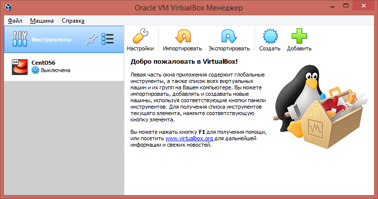

Переключитесь в подробный режим, а не экспертный. Если у вас такой же экран, как и ниже, то вы в подробном режиме.
Укажите удобное имя вашей виртуальной машины и путь её размещения и нажмите далее. В качестве примера используется SayoriOS
Тип установите Other и версия Other/Unknown

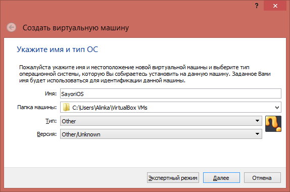

Выберите количество оперативной памяти, которая будет выделена виртуальной машине. Можно оставить рекомендованное 64 МБ, но мы рекомендуем выделять с запасом 256 МБ.

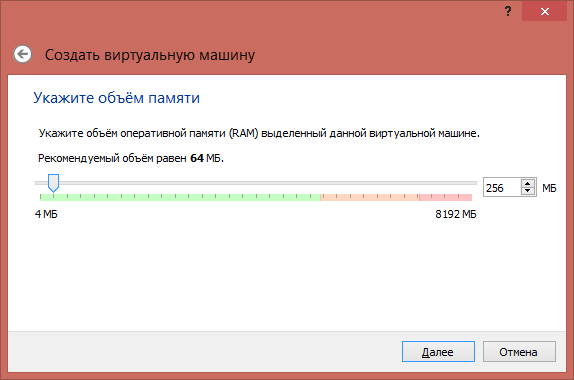

Выберите жесткий диск, лучше создать новый.

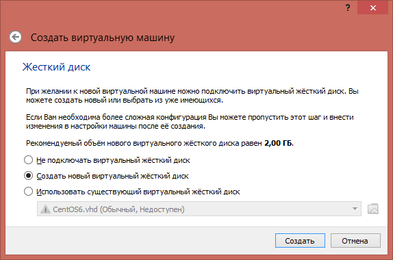

Выбираем удобный формат файла жесткого диска, мы рекомендуем VHD (Virtual Hard Disk)

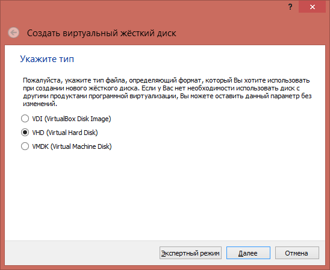

Выбираем динамический, так он не будет занимать место, пока оно не используется.

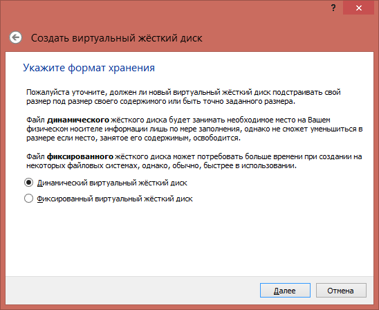

Теперь указываем размер жесткого диска. 2 гб будет вполне достаточно.

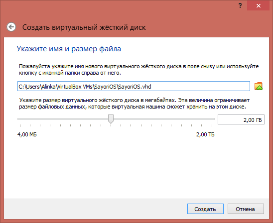

 После создания виртуальной машины, не запускаем а идем в настройки.

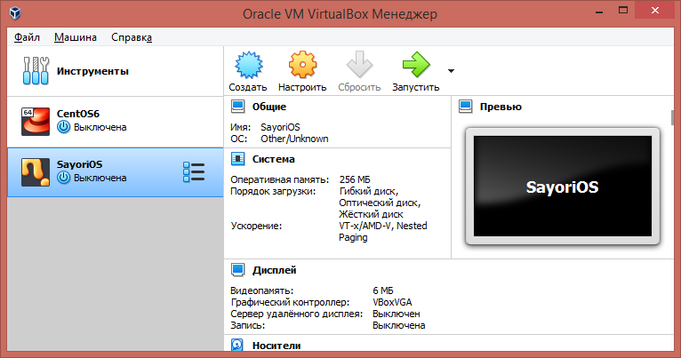

Применяем следующие настройки:

Система > Материнская плата > Дополнительные возможности > Включить I/O APIC

Система > Материнская плата > Дополнительные возможности > Часы в системе UTC

без отметки Nested Paging - ядро работает очень медленно

Система > Ускорение > Аппаратная виртуализация > Включить Nested Paging

Дисплей > Экран > Видеопамять > Ставим 128 МБ

Дисплей > Экран > Ускорение > Включить 3D-ускорение

Носители > Диск > Дисковод > Оптический привод . Выбираем файл с ядром

Сеть > Адаптер 1 > Тип адаптера > Паравиртуальная сеть virtio-net

для получение логов от операционной системы

COM-порты > Порт 1 > Включить последовательный порт

COM-порты > Порт 1 > Режим порта > Перенаправить в файл

COM-порты > Порт 1 > Путь/адрес > Путь к файлу (если его нет, то он будет создан)

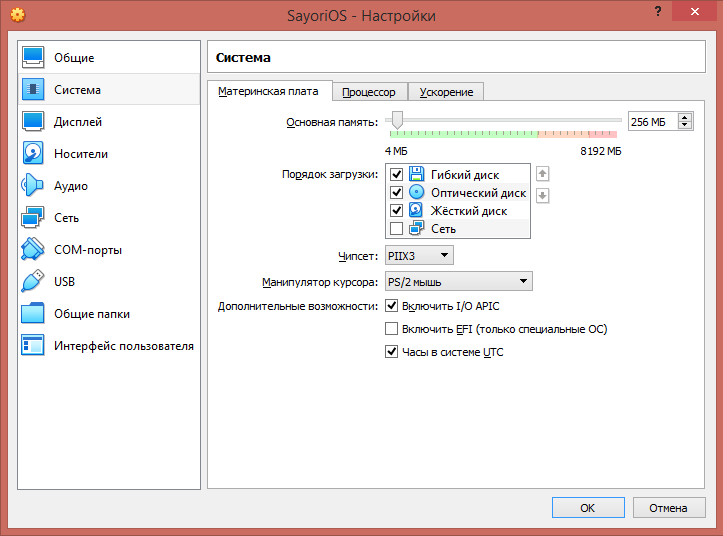
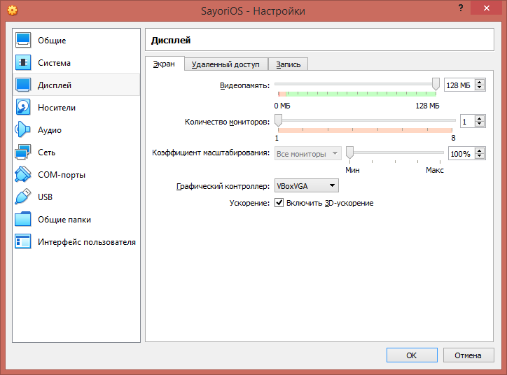
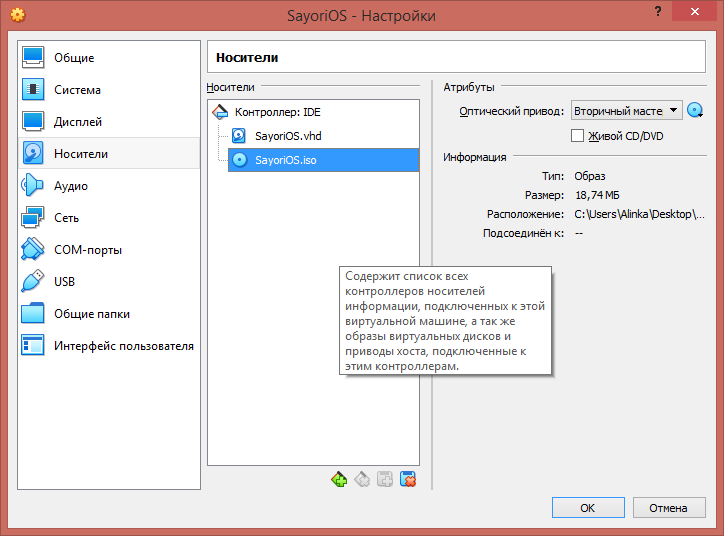
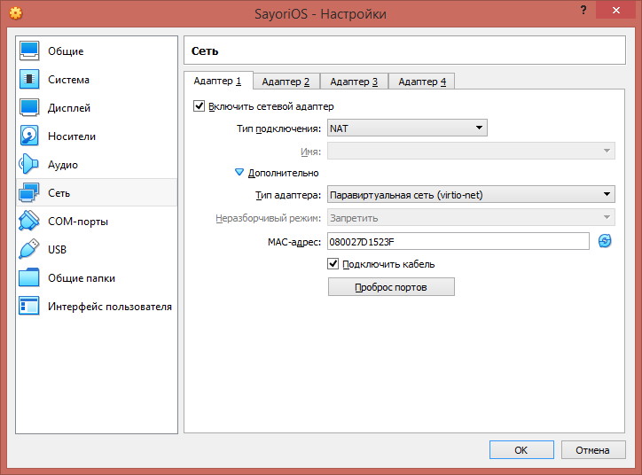
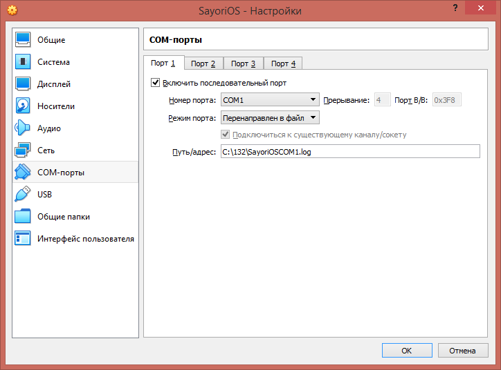

## <a id="contibution">Вклад в проект</a>

Мы рады новым разработчикам и пользователям SayoriOS! Есть несколько способов, которыми вы можете внести свой вклад в проект:

### <a id="developers">Если вы разработчик</a>

Если вы разработчик, вы можете помочь, добавляя новые функции, устраняя ошибки или улучшая существующий код. Для этого вам нужно сделать следующее:

- Скачайте репозиторий проекта на свой локальный компьютер.
- Создайте новую ветку для вашей работы.
- Внесите изменения и фиксируйте их с использованием Git.
- Отправьте запрос на объединение (Pull Request) в основную ветку проекта.

Мы будем рады вашим вкладам и готовы рассмотреть ваши Pull Request'ы.

### <a id="testers">Если вы тестировщик</a>

Если вы нашли ошибку в проекте или у вас есть предложения по улучшению, пожалуйста, создайте новый Issue в репозитории проекта. Опишите проблему или предложение подробно, чтобы мы могли понять и рассмотреть их.

Еще одним способом помочь проекту является тестирование. Вы можете протестировать новые функции, исправления ошибок и сообщить о найденных проблемах.

Последний релиз: https://github.com/pimnik98/SayoriOS/releases

### <a id="techwriters">Документирование</a>

Приветствуется вклад Technical Writers!

### <a id="adv">Пиар</a>

Если вы готовы сделать обзор ОС или написать о ней где-нибудь, пожалуйста свяжитесь с координационной группой проекта.

## <a id="legalinfo">Правовая информаиция<a/>

### <a id="denialofresponsibility">Отказ от отвественности</a>

SayoriOS это не дистрибутив Linux, это совершенно-новый проект который не имеет за собой компании или организации которая могла бы дать гарантий.

Ядро SayoriOS имеет открытый исходный код, вы можете сами удостовериться в отсутствии вредоносного ПО изучая файлы этого репозитория.

При использовании материалов вы обязуетесь соблюдать авторские права.

Участники проекта не несут ответственности за причиненный ущерб возникший в результате использования проекта. Используйте на свой страх и риск.

Запуск ядра возможен на реальном оборудовании, были тесты и на некоторых устройствах оно реально запустилось, хоть и с ограничениями

## <a id="contributors">Контрибьюторы</a>

* [Никита Пиминов](https://github.com/pimnik98) (Создатель SayoriOS)
* [Андреян Павленко](https://github.com/NDRAEY)
* [Михаил Глухов](https://github.com/rigidus)
